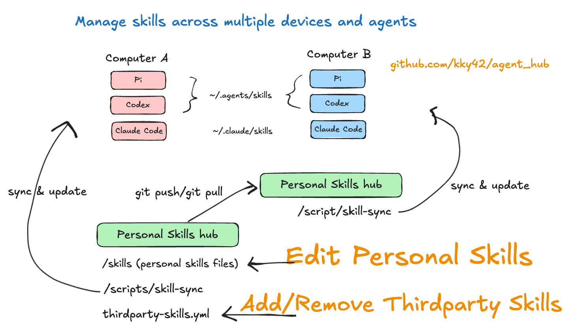

# agent_hub

One place to manage global skills across Codex, Pi, and Claude Code.



## What Lives Here

- `skills/` is where personal skills live.
- `thirdparty-skills.yml` records third-party skills to install.
- `scripts/` applies this setup to the current machine.

## Use It

```bash
./scripts/skill-sync
```

That command is safe to run repeatedly. It links personal skills into the agent
runtime folders and applies the third-party skill manifest.

If this machine already has skills installed by `npx skills`, import them first:

```bash
./scripts/skill-migrate
```

## Daily Workflow

For personal skills, add/edit/remove skill folders under `skills/`, then run:

```bash
./scripts/skill-sync --personal-only
```

Personal skills are linked as flat folders such as
`~/.agents/skills/kaggle` and `~/.claude/skills/kaggle`. Edits to an active
linked skill are visible immediately; run `skill-sync` after adding, removing,
or renaming skill folders. Use `--personal-only` when you do not want to spend
time refreshing third-party skills.

For one third-party skill, update `thirdparty-skills.yml` first, then run a
targeted sync:

```bash
./scripts/skill-sync --thirdparty-only --install web-design-guidelines
```

Use `npx skills add <source> --list` only for discovery. The YAML file is the
source of truth for add/remove decisions. `--install` installs or updates only
the named skill from the manifest.

Example:

```yaml
skills:
  - skill: web-design-guidelines
    source: vercel-labs/agent-skills
    agents:
      - codex
      - claude-code
```

To remove a third-party skill, delete its YAML entry, then run:

```bash
./scripts/skill-sync --thirdparty-only --remove web-design-guidelines
```

Use the full `./scripts/skill-sync` when setting up a machine or intentionally
reconciling every third-party skill. It removes any stale npx-managed skills and
refreshes the full manifest.

If an upstream skill disappears, `skill-sync` warns and continues with the rest
of the manifest.

Across machines, commit and push the repo after changing `skills/` or
`thirdparty-skills.yml`. On another computer:

```bash
git pull
./scripts/skill-sync
```

## Choose Your Agents

The `agents` list in `thirdparty-skills.yml` is passed to `npx skills --agent`.
Change it to match the agents you use.

```yaml
agents:
  - codex
  - claude-code
```

On this setup, `codex` installs to `~/.agents/skills`, and Pi also reads that
folder. Keep `pi` out of the third-party list unless you deliberately want a
second Pi-native install under `~/.pi/agent/skills`.

To see supported `npx skills` agent names, run:

```bash
npx skills --help
```

Personal skill target folders are configured with `AGENT_HUB_SKILL_TARGETS`.
The default is:

```bash
AGENT_HUB_SKILL_TARGETS="$HOME/.agents/skills:$HOME/.claude/skills"
```

Set that variable before running `skill-sync` if your agents use different
runtime folders.
